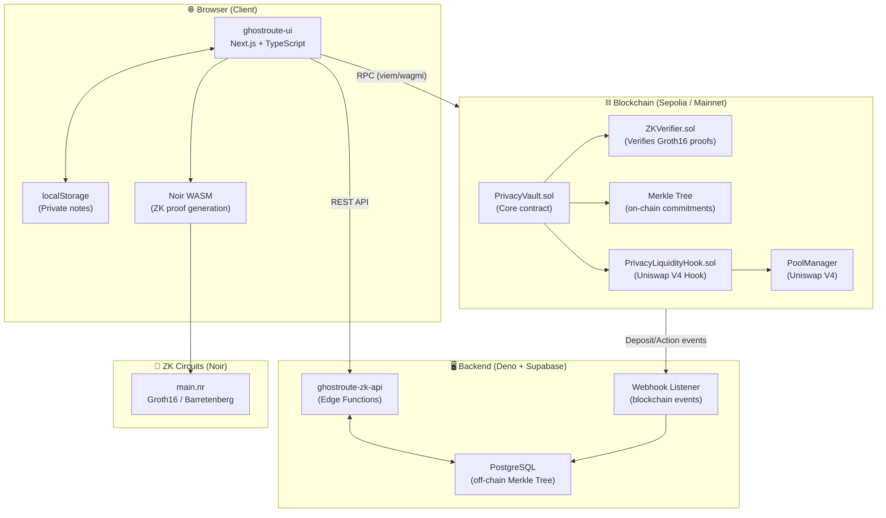
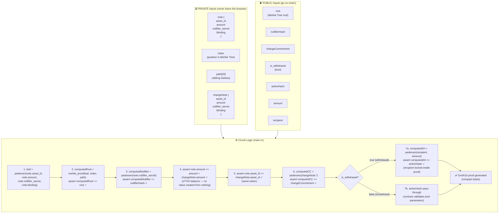
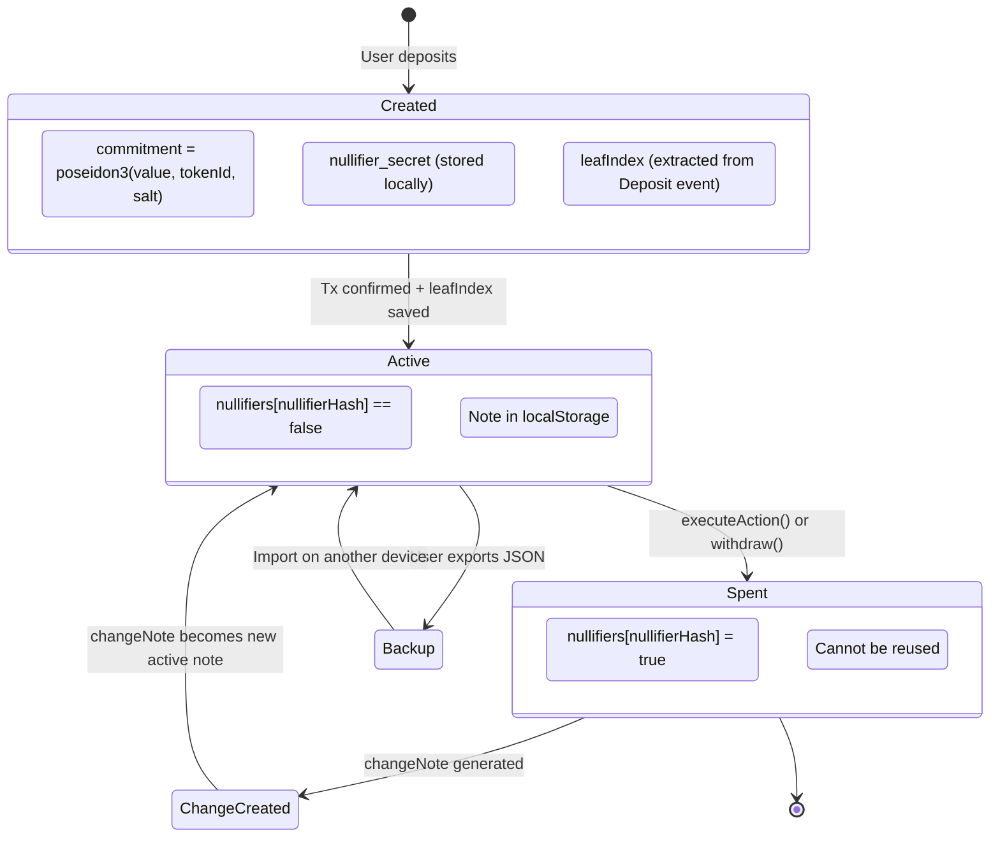
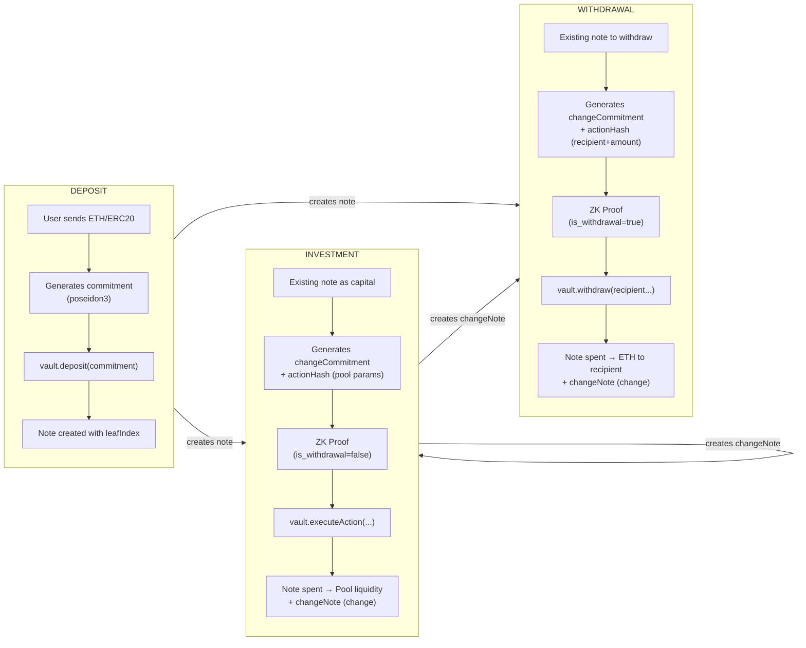
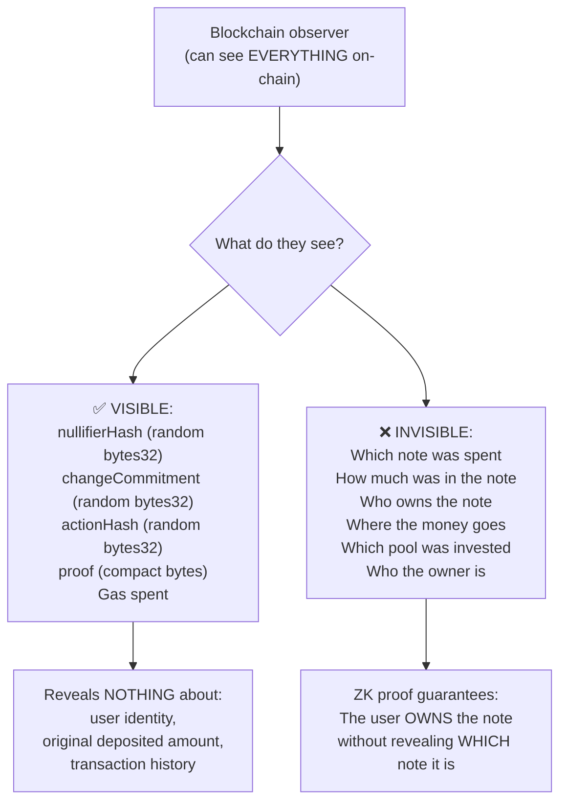

# GhostRoute — Complete Flow Diagram

## 1. Architecture Overview

---

## 2. Deposit Flow

```mermaid
sequenceDiagram
    actor User as 👤 User
    participant UI as ghostroute-ui<br/>(useDeposit.ts)
    participant LS as localStorage
    participant BC as PrivacyVault.sol
    participant API as ghostroute-zk-api
    participant DB as PostgreSQL

    User->>UI: Enters amount and token (e.g. 1 ETH)

    rect rgb(20, 40, 60)
        Note over UI: Local secret generation
        UI->>UI: salt = randomBytes(32)
        UI->>UI: nullifier_secret = randomBytes(32)
        UI->>UI: commitment = poseidon3([value, tokenId, salt])
        UI->>UI: Creates local note { commitment, nullifier, value, token }
    end

    rect rgb(20, 60, 40)
        Note over UI,BC: Blockchain transaction
        alt ETH
            UI->>BC: deposit(commitment, nullifier) { value: 1 ETH }
        else ERC20
            UI->>BC: approve(vault, amount)
            UI->>BC: depositERC20(token, amount, commitment, nullifier)
        end
        BC->>BC: commitments[commitment] = true
        BC->>BC: Inserts into Merkle Tree → updates currentRoot
        BC->>BC: nextLeafIndex++
        BC-->>UI: Emit Deposit(commitment, leafIndex, timestamp)
    end

    rect rgb(60, 20, 40)
        Note over UI,LS: Save note with leafIndex
        UI->>UI: Extracts leafIndex from Deposit event
        UI->>UI: note.leafIndex = leafIndex
        UI->>LS: addNote(full note)
    end

    rect rgb(40, 20, 60)
        Note over BC,DB: Backend syncs state
        BC-->>API: Webhook: Deposit event detected
        API->>DB: Inserts commitment into off-chain Merkle Tree
        API->>DB: Updates leafIndex and root
    end

    UI-->>User: ✅ Deposit confirmed! Note saved locally.
```

---

## 3. Pool Investment Flow

```mermaid
sequenceDiagram
    actor User as 👤 User
    participant UI as ghostroute-ui<br/>(usePoolInvestment.ts)
    participant LS as localStorage
    participant WASM as Noir WASM<br/>(ZK circuit)
    participant API as ghostroute-zk-api
    participant BC as PrivacyVault.sol
    participant PLH as PrivacyLiquidityHook.sol
    participant PM as Uniswap V4<br/>PoolManager

    User->>UI: Selects note, pool and investment amount

    rect rgb(20, 40, 60)
        Note over UI: Preview calculation (no tx sent)
        UI->>UI: changeValue = note.value - investAmount - gasEstimate
        UI->>UI: changeSalt = randomBytes(32)
        UI->>UI: changeCommitment = poseidon3([changeValue, tokenId, changeSalt])
        UI->>UI: actionHash = keccak256(poolId, tickLower, tickUpper, amount0, amount1)
        UI->>UI: Creates local changeNote { changeValue, token, changeSalt }
        UI-->>User: Shows preview (change amount, actionHash)
    end

    User->>UI: Confirms investment

    rect rgb(60, 40, 20)
        Note over UI,WASM: ZK Proof generation<br/>(PRIVATE — stays in browser)
        UI->>UI: nullifierHash = keccak256(note.nullifier_secret)
        UI->>API: GET /merkle-path?leafIndex=N
        API-->>UI: { path: [20 hashes], root }
        Note over WASM: PRIVATE inputs (never leave the browser):
        Note over WASM: • full note { asset_id, amount, nullifier_secret, blinding }
        Note over WASM: • index (position in the tree)
        Note over WASM: • path (20 sibling hashes from the Merkle Tree)
        Note over WASM: • changeNote { asset_id, amount, nullifier_secret, blinding }
        Note over WASM: PUBLIC inputs (go on-chain):
        Note over WASM: • root, nullifierHash, changeCommitment
        Note over WASM: • is_withdrawal=false, actionHash, amount
        UI->>WASM: Runs main.nr circuit with inputs
        WASM->>WASM: assert: commitment(note) exists in Merkle Tree
        WASM->>WASM: assert: nullifierHash = pedersen(note.nullifier_secret)
        WASM->>WASM: assert: note.amount == investAmount + changeNote.amount
        WASM->>WASM: assert: note.asset_id == changeNote.asset_id
        WASM->>WASM: assert: commitment(changeNote) == changeCommitment
        WASM-->>UI: proof (compressed Groth16 bytes)
    end

    rect rgb(20, 60, 40)
        Note over UI,BC: Blockchain transaction
        UI->>BC: executeAction(<br/>  proof,<br/>  root,<br/>  nullifierHash,<br/>  changeCommitment,<br/>  actionHash,<br/>  investAmount,<br/>  uniswapParams<br/>)
        BC->>BC: ZKVerifier.verify(proof, publicInputs) ✓
        BC->>BC: nullifiers[nullifierHash] == false? ✓ (not spent)
        BC->>BC: root == currentRoot? ✓ (proof is current)
        BC->>BC: actionHash != 0? ✓
        BC->>BC: Sets nullifiers[nullifierHash] = true
        BC->>BC: Inserts changeCommitment into Merkle Tree
        BC->>BC: currentRoot = keccak256(currentRoot || changeCommitment)
        BC->>BC: nextLeafIndex++
        BC->>PLH: addLiquidityWithPrivacy(poolKey, liquidityParams, proof, publicInputs)
        PLH->>PLH: Validates authorization via transient storage (EIP-1153)
        PLH->>PLH: computeLiquidityActionHash(key, params, vault) == actionHash ✓
        PLH->>PM: modifyLiquidity(poolKey, liquidityParams)
        PM-->>PLH: Liquidity added ✓
        PLH-->>BC: Emit PrivacyLiquidityAdded(poolId, liquidity, actionHash)
        BC-->>UI: Emit ActionExecuted(nullifier, changeCommitment, actionHash, amount, changeIndex)
    end

    rect rgb(60, 20, 40)
        Note over UI,LS: Update local state
        UI->>LS: markAsSpent(note.commitment, txHash)
        UI->>UI: changeNote.leafIndex = changeIndex (from event)
        UI->>LS: addNote(changeNote)
    end

    UI-->>User: ✅ Investment confirmed! Change note saved.
```

---

## 4. Withdrawal Flow

```mermaid
sequenceDiagram
    actor User as 👤 User
    participant UI as ghostroute-ui<br/>(useWithdraw.ts)
    participant LS as localStorage
    participant WASM as Noir WASM<br/>(ZK circuit)
    participant API as ghostroute-zk-api
    participant BC as PrivacyVault.sol

    User->>UI: Selects note, amount and recipient address

    rect rgb(20, 40, 60)
        Note over UI: Change calculation
        UI->>UI: changeValue = note.value - withdrawAmount
        UI->>UI: changeCommitment = poseidon3([changeValue, tokenId, changeSalt])
        UI->>UI: actionHash = pedersen(recipient, withdrawAmount)
        Note over UI: ⚠️ recipient is INSIDE the actionHash<br/>Any tampering invalidates the proof!
    end

    rect rgb(60, 40, 20)
        Note over UI,WASM: ZK Proof generation
        UI->>UI: nullifierHash = keccak256(note.nullifier_secret)
        UI->>API: GET /merkle-path?leafIndex=N
        API-->>UI: { path: [20 hashes], root }
        UI->>WASM: Runs circuit with is_withdrawal=true
        WASM->>WASM: assert: commitment(note) exists in Merkle Tree
        WASM->>WASM: assert: nullifierHash = pedersen(note.nullifier_secret)
        WASM->>WASM: assert: note.amount == withdrawAmount + changeNote.amount
        WASM->>WASM: assert: note.asset_id == changeNote.asset_id
        WASM->>WASM: assert: commitment(changeNote) == changeCommitment
        WASM->>WASM: assert: actionHash == pedersen(recipient, withdrawAmount) ✓ ← key difference!
        WASM-->>UI: proof (Groth16 bytes)
    end

    rect rgb(20, 60, 40)
        Note over UI,BC: Blockchain transaction
        UI->>BC: withdraw(<br/>  proof,<br/>  root,<br/>  nullifierHash,<br/>  changeCommitment,<br/>  actionHash,<br/>  withdrawAmount,<br/>  recipient<br/>)
        BC->>BC: ZKVerifier.verify(proof, publicInputs) ✓
        BC->>BC: nullifiers[nullifierHash] == false? ✓
        BC->>BC: root == currentRoot? ✓
        BC->>BC: Recomputes: actionHash == pedersen(recipient, amount)? ✓
        BC->>BC: Sets nullifiers[nullifierHash] = true
        BC->>BC: Inserts changeCommitment into Merkle Tree
        BC->>BC: currentRoot = keccak256(currentRoot || changeCommitment)
        alt ETH
            BC->>User: transfer(recipient, withdrawAmount) 💸
        else ERC20
            BC->>User: IERC20(token).transfer(recipient, withdrawAmount) 💸
        end
        BC-->>UI: Emit Withdrawal(nullifier, changeCommitment, recipient, amount)
    end

    rect rgb(60, 20, 40)
        Note over UI,LS: Update local state
        UI->>LS: markAsSpent(note.commitment, txHash)
        UI->>LS: addNote(changeNote) ← change stays in vault
    end

    UI-->>User: ✅ Withdrawal confirmed! Funds sent to recipient.
```

---

## 5. ZK Circuit Internals (main.nr)

---

## 6. UTXO Model — Note Lifecycle

---

## 7. Comparison: Deposit vs Investment vs Withdrawal

---

## 8. Privacy — Why Is It Private?

