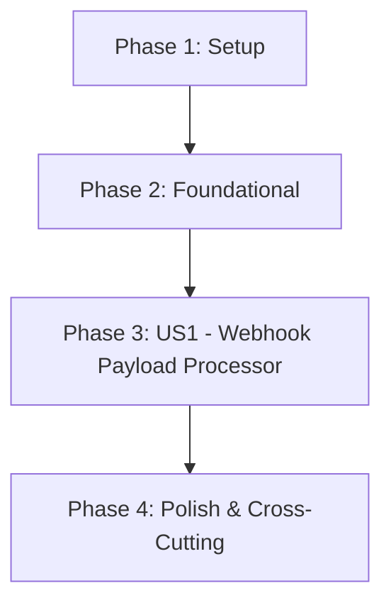

# Tasks: Webhook Payload Processor (Logic)

**Feature**: 011-webhook-payload-processor | **Date**: 2026-02-04 | **Spec**: [spec.md](./spec.md)
**Branch**: `011-webhook-payload-processor`

## Summary

Implement the logic to parse and process the specific JSON payload format from the external EVM listener. This includes dynamic mapping of decoded parameters, idempotent event processing using TransactionHash + LogIndex, and Merkle Tree updates for UTXO management.

## User Stories

This feature contains 1 user story implementing the complete webhook payload processor functionality.

## Dependencies



## Parallel Execution Opportunities

- Type definitions can be implemented independently from database schema
- Mapper utility is independent from idempotency checker
- Merkle updater logic is independent from event processor orchestration
- Unit tests for each module can be written in parallel

## Phase 1: Setup

**Goal**: Initialize project structure and configuration

**Independent Test Criteria**: Project compiles with `deno check` and configuration is valid

### Tasks

- [X] T001 Create project structure per implementation plan in `ghostroute-zk-api/src/models/webhook-processor/`
- [X] T002 Create deno.json configuration file in `ghostroute-zk-api/` with proper permissions and imports
- [X] T003 Create .env.example configuration template in `ghostroute-zk-api/` with DATABASE_URL, SUPABASE_URL, SUPABASE_KEY, LOG_LEVEL, MERKLE_TREE_DEPTH, DEFAULT_CHAIN_ID, SUPPORTED_CHAIN_IDS

## Phase 2: Foundational

**Goal**: Create database schema and core type definitions required by all user stories

**Independent Test Criteria**: Database tables created and TypeScript types compile without errors

### Tasks

- [X] T004 [P] Create database schema migration for processed_events table in `ghostroute-zk-api/migrations/001_processed_events.sql` with PRIMARY KEY on (transaction_hash, log_index), indexes on vault_address and chain_id
- [X] T005 [P] Create database schema migration for merkle_tree_leaves table in `ghostroute-zk-api/migrations/002_merkle_tree_leaves.sql` with constraints for unique commitment and composite unique on (vault_address, chain_id, leaf_index)
- [X] T006 Create WebhookPayload type definition in `ghostroute-zk-api/src/models/webhook-processor/types.ts` with TransactionHash, LogIndex, ContractAddress, BlockchainNetworkId, DecodedParametersNames, DecodedParametersValues, BlockNumber, BlockHash, EventSignature
- [X] T007 Create DecodedParamsMap type definition in `ghostroute-zk-api/src/models/webhook-processor/types.ts` as Record<string, unknown>
- [X] T008 Create ProcessingResult type definition in `ghostroute-zk-api/src/models/webhook-processor/types.ts` with success, idempotent, eventType, transactionHash, logIndex, vaultAddress, chainId, merkleUpdate, nullifier, processedAt
- [X] T009 Create Database singleton class in `ghostroute-zk-api/src/lib/database.ts` with connection pool management using pg client
- [X] T010 Create database operation functions in `ghostroute-zk-api/src/lib/database.ts` for processed_events: insertProcessedEvent, getProcessedEvent, checkIdempotency

## Phase 3: User Story 1 - Webhook Payload Processor Implementation

**Goal**: Implement complete webhook processing with dynamic mapping, idempotency, and Merkle updates

**Independent Test Criteria**: POST /webhook endpoint processes events correctly with idempotency, deposits create Merkle leaves, ActionExecuted events invalidate notes and create new UTXOs

**Story**: As the GhostRoute protocol, I need to process EVM listener webhook payloads to index privacy vault events with idempotency and maintain Merkle tree state

### Tasks

- [X] T011 Create dynamic parameter mapping utility in `ghostroute-zk-api/src/models/webhook-processor/mapper.ts` with function mapParams(names: string[], values: unknown[]): Record<string, unknown>
- [X] T012 [P] Create validation function for WebhookPayload in `ghostroute-zk-api/src/models/webhook-processor/validator.ts` with regex validation for TransactionHash (66 chars 0x prefix), ContractAddress (42 chars 0x prefix), BlockchainNetworkId (non-negative), array length matching
- [X] T013 Create idempotency check service in `ghostroute-zk-api/src/models/webhook-processor/idempotency.ts` with function checkIdempotency(txHash: string, logIndex: number): Promise<{isDuplicate: boolean, existingEvent?: ProcessedEvent}>
- [X] T014 Create idempotency record function in `ghostroute-zk-api/src/models/webhook-processor/idempotency.ts` with function recordProcessedEvent(payload: WebhookPayload, eventType: string, decoded: Record<string, unknown>): Promise<void>
- [X] T015 Create Merkle tree leaf interface in `ghostroute-zk-api/src/models/webhook-processor/types.ts` for MerkleTreeLeaf entity with id, vault_address, chain_id, leaf_index, commitment, created_at, is_active, spent_at
- [X] T016 Create deposit event handler in `ghostroute-zk-api/src/models/webhook-processor/merkle-updater.ts` with function handleDeposit(decoded: Record<string, unknown>, vaultAddress: string, chainId: number): Promise<{leafIndex: number, commitment: string}>
- [X] T017 Create ActionExecuted event handler in `ghostroute-zk-api/src/models/webhook-processor/merkle-updater.ts` with function handleActionExecuted(decoded: Record<string, unknown>, vaultAddress: string, chainId: number): Promise<{nullifierHash: string, changeCommitment: string, changeIndex: number}>
- [X] T018 Create nullifier lookup function in `ghostroute-zk-api/src/models/webhook-processor/merkle-updater.ts` with function markNoteAsSpent(nullifierHash: string, vaultAddress: string, chainId: number): Promise<boolean>
- [X] T019 Create event type detection in `ghostroute-zk-api/src/models/webhook-processor/event-router.ts` with function determineEventType(decoded: Record<string, unknown>): 'Deposit' | 'ActionExecuted' | 'Unknown'
- [X] T020 Create event processor orchestration service in `ghostroute-zk-api/src/services/event-processor.ts` with async function processWebhookPayload(payload: WebhookPayload): Promise<ProcessingResult>
- [X] T021 Create batch processing function in `ghostroute-zk-api/src/services/event-processor.ts` with async function processBatch(payloads: WebhookPayload[]): Promise<BatchProcessingResult>
- [X] T022 Create webhook HTTP handler in `ghostroute-zk-api/src/services/webhook-server.ts` with POST /webhook endpoint supporting single payload processing
- [X] T023 Create batch webhook HTTP handler in `ghostroute-zk-api/src/services/webhook-server.ts` with POST /webhook/batch endpoint supporting up to 100 events
- [X] T024 Create health check handler in `ghostroute-zk-api/src/services/webhook-server.ts` with GET /health endpoint returning database and merkleTree status

## Phase 4: Polish & Cross-Cutting Concerns

**Goal**: Add comprehensive error handling, logging, and test coverage

**Independent Test Criteria**: All tests pass, error scenarios handled gracefully, logging provides observability

### Tasks

- [X] T025 Create error types and handler in `ghostroute-zk-api/src/models/webhook-processor/errors.ts` with PayloadValidationError, IdempotencyError, MerkleUpdateError, DatabaseError
- [X] T026 Create structured logging utility in `ghostroute-zk-api/src/lib/logger.ts` with debug, info, warn, error levels and context injection
- [X] T027 [P] Write unit tests for mapper in `ghostroute-zk-api/tests/unit/mapper.test.ts` covering empty arrays, single element, multiple elements, type preservation
- [X] T028 [P] Write unit tests for validator in `ghostroute-zk-api/tests/unit/validator.test.ts` covering valid payloads, invalid TransactionHash, invalid ContractAddress, mismatched array lengths
- [X] T029 [P] Write unit tests for idempotency in `ghostroute-zk-api/tests/unit/idempotency.test.ts` covering duplicate detection, new event recording, concurrent requests
- [X] T030 [P] Write unit tests for merkle-updater in `ghostroute-zk-api/tests/unit/merkle-updater.test.ts` covering deposit insertion, note invalidation, UTXO creation
- [X] T031 Write integration test for event processor in `ghostroute-zk-api/tests/integration/event-processor.test.ts` covering full webhook processing flow with mocked database
- [X] T032 Create mock E2E test scenario in `ghostroute-zk-api/scripts/mock-e2e-test.ts` for testing without infrastructure with sample webhook payloads

## Test Commands

```bash
# Run unit tests
cd ghostroute-zk-api
export PATH="$HOME/.deno/bin:$PATH"
deno test --no-check --allow-all tests/unit/

# Run integration tests
deno test --no-check --allow-all tests/integration/

# Mock E2E test (without infrastructure)
deno run --allow-all scripts/mock-e2e-test.ts
```

## Implementation Strategy

### MVP Scope (Phase 3 Tasks Only)

The MVP includes Tasks T011-T024, which implement:
- Dynamic parameter mapping utility
- Webhook payload validation
- Idempotency checking and recording
- Merkle tree updates for deposits and ActionExecuted events
- Event routing based on decoded parameters
- Complete event processor orchestration
- HTTP endpoints for single and batch processing

### Incremental Delivery

1. **Sprint 1**: T001-T010 - Foundation (types, database, config)
2. **Sprint 2**: T011-T019 - Core utilities (mapper, validator, idempotency, merkle-updater)
3. **Sprint 3**: T020-T024 - Orchestration and HTTP layer
4. **Sprint 4**: T025-T032 - Testing and polish

## Task Summary

| Phase | Task Count | Description |
|-------|------------|-------------|
| Phase 1: Setup | 3 | Project initialization and configuration |
| Phase 2: Foundational | 6 | Database schema and core types |
| Phase 3: US1 | 14 | Webhook processor implementation |
| Phase 4: Polish | 8 | Error handling, logging, tests |
| **Total** | **31** | |

## Parallel Execution Examples

Within Phase 2, tasks T004-T005 (database migrations) can run in parallel with T006-T010 (type definitions and database layer).

Within Phase 3, the following groups can be executed in parallel:
- Group A: T011 (mapper), T012 (validator) - parsing utilities
- Group B: T013-T014 (idempotency) - independent of other logic
- Group C: T015-T018 (merkle-updater) - independent tree operations
- Group D: T019 (event-router) - simple routing logic

Within Phase 4, all unit tests (T027-T030) can run in parallel once their corresponding implementations are complete.
